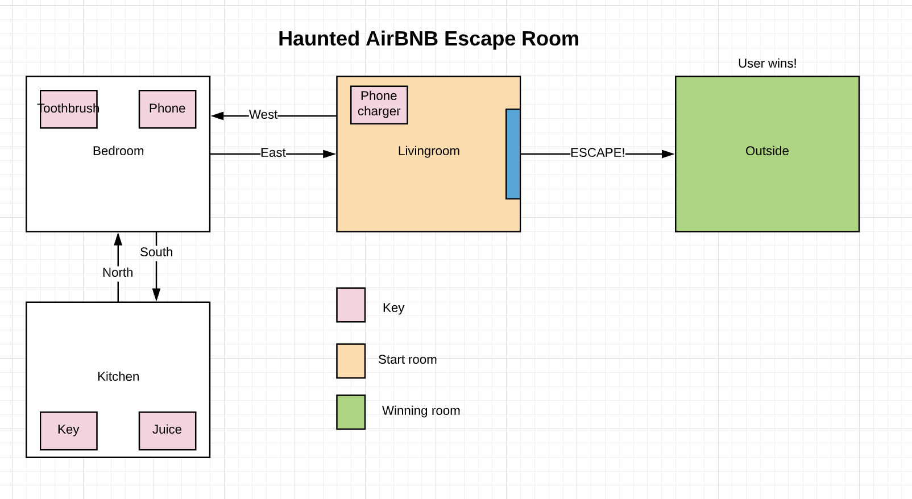
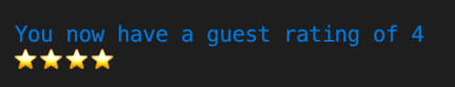

# Installation guide

In order to play the game, please fork and clone the repository from [here]("https://github.com/")

1. Ensure you have ruby downloaded and installed to your workstation.

2. Open and ensure your terminal is pointing to the directory.

3. Run the command:

```
./run_app.sh
```

This file will ensure all gems required by the terminal app are installed before program begins.

# Purpose & Scope


## Storyline: Haunted Airbnb

You have rented an Airbnb for the night and during your stay have realised that you are not the only guest. In order to survive, you must interact with the apartment and try to escape.

Each interaction will bring you a hint or a step closer to your freedom. The aim is to leave the Airbnb while keeping your guesting rating intact.

If you use the incorrect items and your score reaches 0, the Airbnb g-host will kill you and you will lose the game.

To ensure you survive your not so hospitable host, find the key located in the kitchen and head back to the livingroom and you will bid your escape.

The following map can be used to aid you in your journey, good luck!



## Purpose

The purpose of this game is to provide the user with a unique interface in order to tell them a story. It is being developed for Coder Academy Term 1 Assignment 3 and its intended audience is teachers, peers, friends and family.


This game is being developed in order to progress and reflect my skills as an object orientated programmer. Creation of this game has increased my understanding of Ruby data structures and the tools we have access to.


The game will present the user with game and storyline information, followed by a list of available commands. As the user progresses through the game, different commands and items will become available. 


Through a colourful command line interface and responsive gameplay descriptions, the user will move their way through the Airbnb to find new items. The story will be told as the user travels to new rooms and collects new items.


# Features


## USERNAME

On program load, the user is prompted a message asking for their name. This will allow the game to store their score and name.

If they do not enter any value, their name will be recorded as ‘anonymous’. 

This is completed by a separate function and is before the start menu and new game because it will prevent the user from having to enter their name each time they start a new game. 


## START MENU
This feature allows the user to play the game multiple times without the program exiting.
They are given a menu prompt of **Start, Player Scores or Quit.**

Start will create a new game, player scores will show a table of previous games and quit will exit the program. This will loop until quit is selected.


## SCOREBOARD

The game records the name and final rating of the player when they escape the Airbnb.

Players can access these scores from the ‘Player Score’ button on the start menu. The program will display all scores in a table to the user.

It will show for 5 seconds and then loop back to the start menu.


## COLLECTING ITEMS

As the user enters a room, they will be told of the items available for interaction. 

They must enter the command ‘take’ followed by the item to pick it up.

Example: **take phone**

Item collection will allow the user to carry the item with them until they are ready to use it. This is important as some items are ‘keys’. Meaning the user must use them in a specific room in order to win the game.


## VIEW BACKPACK

When the user wants to a view the items, they have collected but not yet used they can use the command **Backpack.**

This will print the items in the players backpack.


## USE ITEM

When a user wishes to use an item, they must enter ‘use’ followed by the item they are using.

Example: **use phone**

This item must be in players backpack otherwise there will be an error message outputted to user.

If item is a score item, it will adjust the users Airbnb score accordingly and print the score back to user. If it is a key and they are in the room the key needs to be used, they will win the game.


## MOVING ROOMS

A user is able to move rooms in the game through the ‘go’ command. This command must be followed by a direction such as ‘north’. 

This will allow the user to take and user new game items. 

Example: **go south**

The direction must be available to the user or there will be an error message.


## INCREASE / DECREASE SCORE

As the user interacts with different items, they will see their Airbnb guest rating adjusted. 

If they use a good item then their score will improve, and if they use a bad item then their score will increase.

Their new score is then printed to them using start symbols. 

For example: 


 

# User Interaction

At the beginning of the game and every single time the user enters a command (valid or not) all available commands will be printed to user. These commands will also include the items and exits available to the user.

## Menu

Interaction with the start menu is a simple keyboard selection. The user navigates the options using the keypad and selects an option using the enter key.


## Gameplay

All other game play is interacted with using the command words (also discussed above: Features):

* take
* use
* go
* backpack
* help
* quit

## Errors


If a user enters an invalid command (enters anything but above the commands) then the following error message is printed:

```
That isn't a valid command
```

If a user enters the commands `take, use or go` but the follow doesn’t include a second command:

```
I’ll need more information then that
```

If they enter `take` followed by an item not in the current room

```
This item isn't here
````

If they enter `use` followed by an item not in the players backpack

```
You aren't carrying this item.
```

If they enter `use` and the item is a key but they are not in the correct room:

```
You are not using this item in the correct room!
```

If they enter `go` but the direction is not an available exit:

```
That is not a direction you can travel.
```


# Control Flow


The control flow diagram has been split up for readibility.

## START MENU


## HANDLING INPUT


### One word commands


### Double word commands


### COMPLETE VIEW


# Implementation plan

